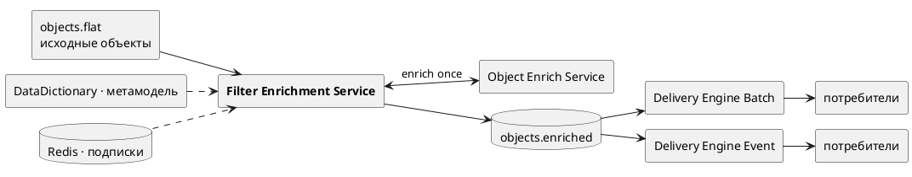

# Filter Enrichment Service

Стоит **перед** Delivery-движками и делает **предфильтрацию + обогащение** исходных объектов.
Читает Kafka-топик `objects.flat`, определяет, каким активным подпискам объект потенциально
релевантен, обогащает объект (или пару before/after) через **Object Enrich Service**, применяет
полные фильтры уже на обогащённых данных и публикует совпавшие объекты — вместе со списком совпавших
подписок — в общий топик `objects.enriched`, который читают Delivery-движки.

Именно этот сервис **производит ровно тот `objects.enriched`**, который потребляют
`delivery-engine-batch` и `delivery-engine-event`: два конверта (`OBJECT` и `BEFORE_AFTER`),
предвычисленные совпадения подписок и блок `metadata`. Движки фильтр не пересчитывают — они доверяют
тому, что положил сюда этот сервис.

Самостоятельное приложение и отдельный git-репозиторий (не входит в Subscription Service и Delivery
Engine): свой Docker image, Helm chart, CI и релизный цикл.



## Ключевые принципы (кратко)

1. **Обогащение — один раз на запись.** Один HTTP-вызов Enrich Service на входную запись, без
   микробатчинга: `GET .../{objectClass}` для одиночного объекта, `POST .../revisions` для пары
   before/after.
2. **Предфильтр на трёхзначной логике (Клини).** По «плоскому» входу сравнение над присутствующим
   полем — `TRUE`/`FALSE`, над полем, доступным только после обогащения — `UNKNOWN`. Подписка
   отбраковывается кандидатом **только** при твёрдом `FALSE` (для `BEFORE_AFTER` — только когда обе
   стороны твёрдо `FALSE`), поэтому дорогое обогащение делается лишь для реальных кандидатов.
3. **Фильтр никогда не «ложь по умолчанию».** Если фильтр нельзя вычислить (нужное поле не заполнено
   после обогащения) — сообщение уходит в **enrichment DLQ**, а не молча отбрасывается.
4. **Метамодель — в памяти.** Доменная модель грузится из DataDictionary один раз на старте (и при
   перезагрузке конфигурации), фильтры компилируются один раз — никогда не на каждое сообщение.
5. **Конфигурация подписок — только из Redis.** Postgres не используется. Обслуживаются лишь подписки
   `status = ACTIVE` c нужным типом движка (`SERVED_ENGINE`, по умолчанию `OBJECT_BATCH`).

## Стек

Java 17, Spring Boot 3.3, spring-kafka, spring-data-redis, spring-web (RestClient) + Apache
HttpClient5 (пул), `rsql-parser`, resilience4j (circuit breaker + bulkhead), spring-retry, Actuator +
Micrometer/Prometheus, Maven.

## Быстрый старт

```bash
mvn clean package
KAFKA_BOOTSTRAP=kafka:9092 REDIS_HOST=redis \
  ENRICH_SERVICE_URL=http://object-enrich-service:8080 \
  DATA_DICTIONARY_URL=http://data-dictionary:8080 \
  java -jar target/filter-enrichment-service-0.1.0.jar
```

Все параметры задаются переменными окружения — см. [docs/configuration.md](docs/configuration.md).

## Пример входа и выхода

Вход (`objects.flat`) — «голый» плоский объект, без конверта и без `messageType`; тип выводится из
структуры (пара `before`/`after` ⇒ `BEFORE_AFTER`, иначе `OBJECT`):

```json
{ "objectClass": "FxSpotForwardTrade", "globalId": 42, "id": 1007,
  "portfolioId": "P1", "status": "LIVE", "savedAt": "2026-07-17T10:00:00Z" }
```

Выход (`objects.enriched`), конверт `OBJECT`, ключ Kafka = `globalId`:

```json
{ "matchedSubscriptionIds": ["sub-123"],
  "object": { "objectClass": "FxSpotForwardTrade", "globalId": 42, "id": 1007,
              "portfolioId": "P1", "counterparty": { "code": "ACME" } },
  "metadata": { "enrichmentStatus": "FULL", "enrichedAt": "2026-07-17T10:00:01Z" } }
```

Полный входной и выходной контракт — в [docs/contract.md](docs/contract.md).

## Документация

| Документ | О чём |
|---|---|
| [docs/contract.md](docs/contract.md) | **Входной и выходной контракт** — `objects.flat`, конверты `OBJECT`/`BEFORE_AFTER` в `objects.enriched`, `metadata`/`enrichmentStatus`/`missingFields`, ключ Kafka, чтение движками |
| [docs/architecture.md](docs/architecture.md) | Место в системе, компоненты, пошаговый алгоритм, диаграммы, гарантии доставки, backpressure, DLQ |
| [docs/configuration.md](docs/configuration.md) | Полный справочник настроек `filter-enrichment.*` и переменных окружения |
| [docs/operations.md](docs/operations.md) | Runbook: health-пробы, метрики, три DLQ, масштабирование, диагностика, деплой |

## Сборка, тесты, запуск

```bash
mvn verify                                   # сборка + юнит-тесты
docker build -t filter-enrichment-service:0.1.0 .
helm install fes helm/filter-enrichment-service
```

Юнит-тесты покрывают трёхзначный предматч и логику Клини, компиляцию фильтра (отказ на коллекциях),
объединение required-полей, сопоставление ревизий (форматы массива/объекта, отсутствие/дубликаты) и
потоки обработки `OBJECT` / `BEFORE_AFTER` (drop без кандидатов, публикация с `matchedSubscriptionIds`,
`beforeMatched || afterMatched`, enrichment-DLQ при ошибке/отсутствии ревизии).
