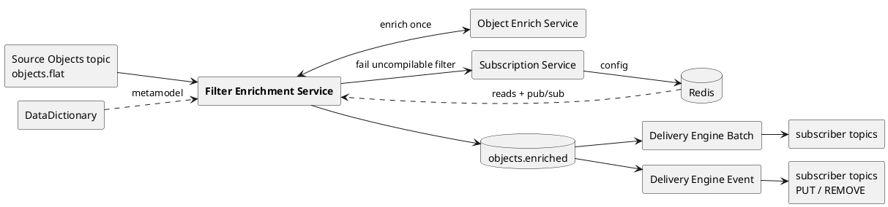
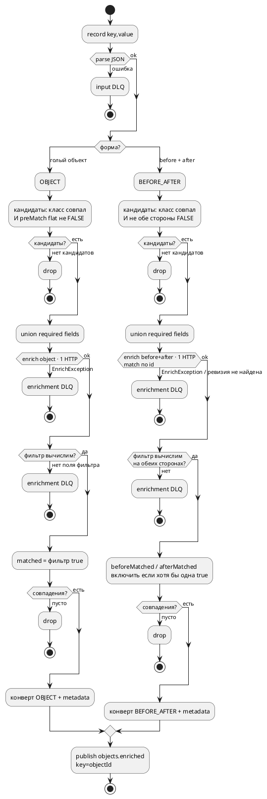
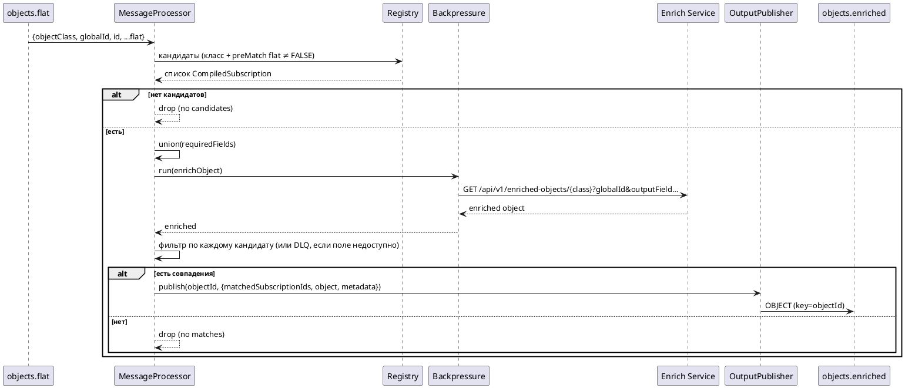
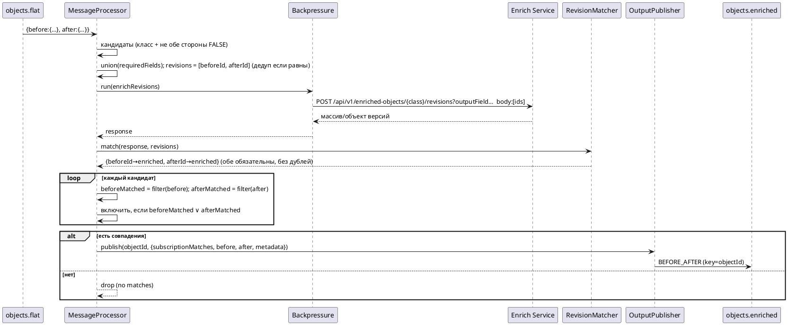

# Архитектура

## Место в системе

Filter Enrichment Service стоит между исходным потоком объектов и Delivery-движками. Он —
**единственный производитель** топика `objects.enriched`: наполняет его конвертами `OBJECT` и
`BEFORE_AFTER` с предвычисленными совпадениями подписок и блоком `metadata`. Delivery-движки читают
этот топик как отдельные consumer-группы и фильтр **не** пересчитывают — доверяют совпадениям отсюда.
Точный контракт — в [contract.md](contract.md).

Сервис обслуживает подписки только выбранного типа движка (`SERVED_ENGINE`, по умолчанию
`OBJECT_BATCH`) и только в статусе `ACTIVE`. Конфигурация подписок читается **исключительно из Redis**
(Postgres не используется); доменная модель — из DataDictionary.

Сервис самостоятельный (свой git-репозиторий, CI/CD, Docker image, Helm chart, релизный цикл) — не
входит в Subscription Service.

## Компоненты

| Пакет | Компонент | Ответственность |
|---|---|---|
| `kafka` | `InputListener` | `@KafkaListener` на `objects.flat`; ставит MDC (`traceId`, `objectId`), передаёт (key, value) процессору |
| `kafka` | `MessageProcessor` | Ядро пайплайна: parse → предматч кандидатов → union required fields → enrich once → фильтр → сборка конверта → publish / drop / DLQ |
| `kafka` | `OutputPublisher` | Сериализует конверт, публикует в `objects.enriched` (key = `objectId`) с ретраями; ошибки сериализации/публикации → output DLQ |
| `kafka` | `DlqPublisher` | Маршрутизирует непроходимые записи в три DLQ (input / enrichment / output) с заголовком `error-reason` |
| `kafka` | `BackpressureManager` | Ограничивает число одновременных enrich-запросов; при насыщении ставит партиции consumer на паузу и возобновляет |
| `domain` | `InputMessageParser`, `InputMessage`, `MessageType` | Разбор реального формата входа; тип выводится из структуры (before+after ⇒ BEFORE_AFTER) |
| `domain` | `RuntimeSubscription`, `EnrichmentStatus` | Модель подписки из Redis; статус обогащения (FULL/PARTIAL) |
| `enrich` | `EnrichClient` | Клиент Object Enrich Service; один вызов на запись; bulkhead + circuit breaker + ретраи с backoff/jitter |
| `enrich` | `RevisionMatcher` | Сопоставляет ответ `POST /revisions` обратно по `id` (порядко-независимо, без дубликатов, обе ревизии обязательны) |
| `enrich` | `EnrichException`, `BackpressureException` | Классификация ошибок обогащения (RETRYABLE/NOT_FOUND/NON_RETRYABLE) и сигнал насыщения bulkhead |
| `fields` | `RequiredFieldsCalculator` | Вычисляет `outputField` = union(поля подписки) + union(поля фильтра), дедуп, детерминированный порядок |
| `filter` | `RsqlFilterCompiler`, `CompiledFilter`, `Tri` | Компилирует RSQL один раз в полный предикат + трёхзначный (Клини) предфильтр |
| `filter` | `JsonPaths`, `Comparisons`, `FilterSelectors` | Навигация по путям, типозависимые сравнения, извлечение class-qualified селекторов |
| `registry` | `SubscriptionRegistry` | In-memory карта обслуживаемых (ACTIVE + этот движок) компилированных подписок |
| `registry` | `SubscriptionCompiler`, `CompiledSubscription` | Компиляция подписки: резолв таргетов, required-поля, компиляция фильтра |
| `registry` | `RuntimeConfigService` | Грузит/обновляет registry из Redis; фейлит некомпилируемые подписки через `SubscriptionFailClient` |
| `registry` | `ConfigChangeListener` | Обработчик Redis pub/sub `CONFIG_CHANGED` (сигнал → перечитать один id или полный reload) |
| `registry` | `RegistryStartupLoader` | Гейтит старт consumer’ов, пока не загружены метамодель + подписки |
| `metamodel` | `MetamodelHolder`, `MetamodelCatalog(Factory)` | Грузит доменную модель из DataDictionary; иерархия классов, скалярные поля, классификация путей фильтра |
| `client` | `SubscriptionFailClient` | `POST /internal/subscriptions/{id}/fail` при ошибке компиляции фильтра |
| `metrics` | `Metrics`, `GaugeConfig` | Счётчики/таймеры/гейджи Micrometer (без `subscriptionId` в лейблах) |
| `health` | `*HealthIndicator`, `HealthProbeController` | Liveness/readiness-пробы (`/health/live`, `/health/ready`) |
| `config` | `KafkaConfig`, `RedisConfig`, `HttpClientConfig`, `RetryConfig`, `FilterEnrichmentProperties` | Проводка Kafka/Redis/HTTP-клиентов/ретраев и типизированные настройки |

## Алгоритм на одну запись

Ключевые свойства:

- **Предматч дешёвый и консервативный.** По плоскому входу отбрасываются только заведомо не-кандидаты
  (твёрдый `FALSE`). Всё, что зависит от ещё-не-обогащённых полей, остаётся `UNKNOWN` и проходит
  дальше — точное решение принимается уже на обогащённых данных.
- **Обогащение — один HTTP-вызов на запись.** `outputField` — это объединение полей всех кандидатов
  (детерминированно отсортированное), поэтому все подписки обслуживаются одним запросом.
- **Фильтр не вычислим ⇒ DLQ, а не «ложь».** Если какое-то поле фильтра отсутствует после обогащения,
  сообщение уходит в enrichment DLQ целиком (см. [надёжность](#гарантии-доставки-и-надёжность)).
- **На запись — не более одного выходного сообщения** (или ни одного при drop).

### Последовательность OBJECT

### Последовательность BEFORE_AFTER

## Runtime-конфигурация и registry

Движок читает конфигурацию подписок **только из Redis** (никогда из Postgres). Контракт принадлежит
Subscription Service:

| Ключ Redis | Смысл |
|---|---|
| `sub:{subscriptionId}` | JSON одной подписки (`subscriptionId, subscriberName, topicName/topicPostfix, targets, fields, filter, engine, status`) |
| `subs:runtime` | Множество id всех runtime-подписок |
| канал `subscriptions:changes` | Pub/sub-сигнал `{ "type":"CONFIG_CHANGED", "subscriptionId":"…" }` |

`ConfigChangeListener` трактует сообщение **только как сигнал**: с `subscriptionId` перечитывает
`sub:{id}`, без него делает полный reload. Если id пропал из Redis — подписка удаляется из registry.
Подписка обслуживается только при `status = ACTIVE` **и** `engine = SERVED_ENGINE`. Если её фильтр не
компилируется (неизвестное поле, путь через to-many коллекцию), движок удаляет её локально и репортит
FAILED через `SubscriptionFailClient`. Одна битая подписка не роняет весь reload — она пропускается.

## Компиляция фильтра и метамодель

Доменная модель грузится один раз из DataDictionary (`GET /api/search-service/metadata/v3`) на старте
и при перезагрузках — **никогда** на каждое сообщение — и хранится в памяти (`MetamodelHolder`).
`MetamodelCatalog` даёт: нормализацию `objectClass` к каноническому имени, проверку кандидатности
(подписка на класс S совпадает с объектом класса X, если S — предок-или-сам X) и классификацию путей
фильтра.

RSQL-фильтр компилируется один раз в `CompiledFilter` с двумя вычислителями:

- `matches(enriched)` — полный булев фильтр на обогащённом объекте;
- `preMatch(flat)` — трёхзначный (Клини) предфильтр на плоском входе (`TRUE`/`FALSE`/`UNKNOWN`).

Class-qualified пути валидируются против модели: путь к неизвестному полю → `FILTER_SCHEMA_MISMATCH`,
путь через to-many коллекцию → `FILTER_TRAVERSES_COLLECTION` (фильтры поддерживаются только над
скалярными / to-one путями). «Голые» плоские селекторы (`portfolioId`) принимаются как есть.

## Гейтинг на старте

Consumer’ы создаются с `autoStartup=false`. `RegistryStartupLoader` (в отдельном демон-потоке после
`ApplicationReadyEvent`) сначала грузит метамодель из DataDictionary и runtime-подписки из Redis,
повторяя попытки с периодом `filter-enrichment.startup.retry-interval-ms`, и только затем стартует
Kafka-листенеры — так ни одна запись не обрабатывается до появления метамодели. До завершения этого
под остаётся **live, но not ready** (см. readiness в [операциях](operations.md)).

## Гарантии доставки и надёжность

- **At-least-once.** Offset коммитится per-record (`AckMode.RECORD`) только после полной обработки
  записи (публикация / drop / DLQ). Авто-коммит выключен. Downstream обязаны дедуплицировать — ключ
  дедупа — `id` версии.
- **Producer:** `acks=all`, идемпотентность включена, сжатие `zstd`, producer-batching (`linger.ms`,
  `batch.size`) — только транспортная оптимизация.
- **Обогащение отказоустойчиво.** `EnrichClient` защищён circuit breaker + bulkhead (resilience4j) и
  повторяет только RETRYABLE-ошибки (429/502/503/504, таймауты, connection reset, circuit open) с
  экспоненциальным backoff + jitter. `404` (NOT_FOUND) и прочие 4xx (NON_RETRYABLE) не повторяются.
  После исчерпания попыток — enrichment DLQ.
- **Фильтр не вычислим ⇒ enrichment DLQ.** Отсутствие поля фильтра после обогащения никогда не
  трактуется как «ложь» — сообщение уходит в DLQ (консервативно).
- **Backpressure.** `BackpressureManager` держит семафор на число одновременных enrich-запросов; при
  насыщении ставит партиции consumer на паузу до освобождения ёмкости. Насыщение bulkhead
  (`BackpressureException`) не фейлит и не DLQ’ит запись — она переобрабатывается под backpressure.
- **DLQ-запись — тоже надёжна.** Если даже запись в DLQ падает после ретраев, исключение
  пробрасывается, offset не коммитится и запись переигрывается.
- **Stateless и горизонтально масштабируемый:** масштабируется числом подов в одной consumer group;
  потолок полезного параллелизма — число партиций входного топика `objects.flat`.

## Dead-letter-очереди

Три DLQ разделяют классы ошибок; каждая запись сохраняет исходные key/value и заголовок `error-reason`.

| DLQ | Топик по умолчанию | Кем наполняется |
|---|---|---|
| input | `filter-enrichment.input.dlq` | Битый/нераспознанный вход: невалидный JSON, не JSON-объект, `BEFORE_AFTER` без обеих сторон, отсутствует `objectClass/objectType`, отсутствует/некорректен `globalId`/`id` |
| enrichment | `filter-enrichment.enrichment.dlq` | Обогащение упало после ретраев, ревизия не найдена/дубликат, поле фильтра недоступно после обогащения |
| output | `filter-enrichment.output.dlq` | Ошибка сериализации конверта или публикации после всех ретраев |

Причины и диагностика — в [операциях](operations.md#dead-letter-очереди).

См. также: [контракт](contract.md) · [конфигурация](configuration.md) · [эксплуатация](operations.md)
